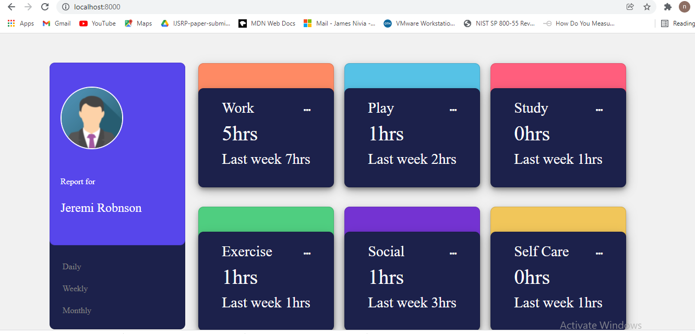

# time-tracking-dashboard
A time-tracking dashboard that switch between viewing Daily, Weekly, and Monthly stats .

## Table of Contents
* [General Info](#general-information)
* [Technologies Used](#technologies-used)
* [Screenshots](#screenshots)
* [Setup](#setup)
* [Usage](#usage)

## General Information

-Pull the data from json file and map it in the html file with proper styling.

## Technologies Used
- HTML 
- CSS 
- JS 
- Bootstrap
- python(to start a webserver) - version 3.7.2

## Screenshots

## Setup

- Download the Project
- Run the command in terminal $ python -m http.server 
- In browser run Localhost:8000
## Usage

- Go throgh the daily,weekly and monthly buttons so that user can view the particular data for each cases.
- This project is open source and available under the [https://github.com/nivia20/time-tracking-dashboard/tree/develop]

